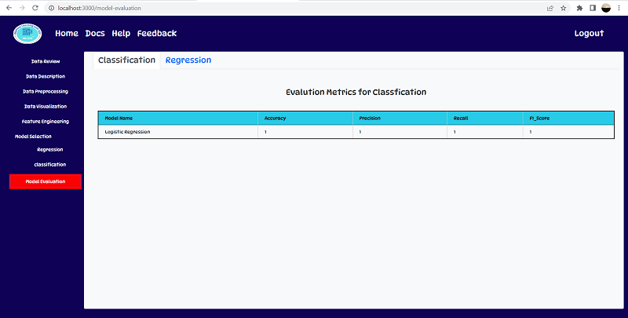

# MLGUI (Machine Learning with GUI)
MLGUI is a web application machine learning tool to build the machine learning model with GUI select-click property. The main purpose of developing this tool is to **save time, effort, and energy** to build models. 
The advantage of this tool is that technical and Non-technical people can build the models without writing Python code with in the few minutes.

>## Steps to use this Tool
    1. Open the MLGUI Tool and Login.


    2. Go to home page and click on **Start** button.


    3. Drag&Drop your dataset click on upload button.


    4. After that all the Machine Learning steps will be visible to perform ahead.


    5. Data Description of dataset.


    6. Data Preprocessing Steps


    7. Data Visualization


    8. Feature Engineering


    9. Model Training and Testing


    10. Model Evaluation



> ## Technology
- Python
- django 3.2
- MySQL
- HTML
- CSS
- Bootsrap
- Machine Learning
- React.js
- D3.js
- plotly.js

> ## Cloud
- GCP

> ## Ops Pipeline
- Mlflow and DVC

> ## Deployment
- cloud

> ## Installation
- get ready with Anaconda3.
- create a conda environment.
    ```git
    conda create -n env_name python=version -y
    ```
- clone the repository.
    ```git
    git clone https://github.com/nhyadav/MLGUI.git
    ```
- install all dependencies.
    ```git
    pip install -r requirements.txt
    ```
- start the application.
    ```bash
    cd ram
    python manage.py runserver
    ```
- to stop the server press ctrl+c.

> ## Contibutor
- Narayan Hari Yadav


# * Thank You! *